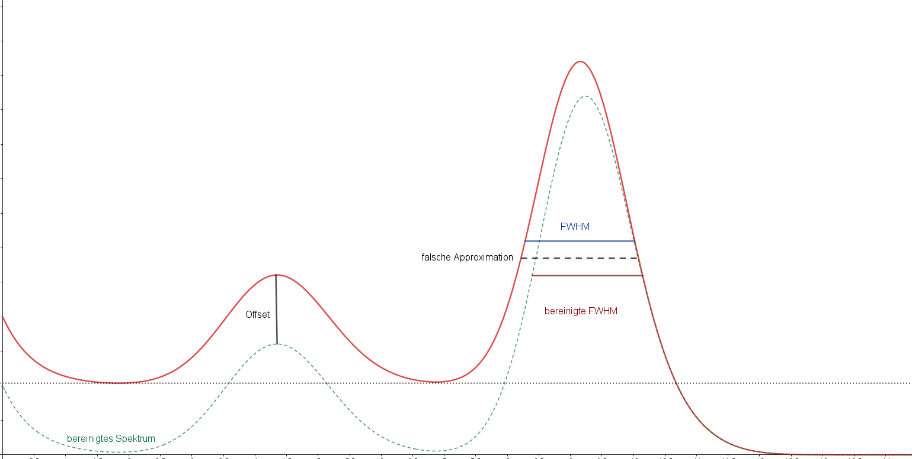

## Studien zur Feldonfiguration in Triple-GEM Detektoren

Hier dokumentieren wir die wesentlichen Errungenschaften und Auswertungsschritte + Codes für die Auswertung der Messergebnisse der Bachelorarbeit, die Überlegungen stützen sich im Wesentlichen auf ein Eisenspektrum, dessen Auswertung wir gern automatisiert ansteuern wollen.

### Autofit der Eisenspektren
Weil wir hunderte Eisenspektren anpassen werden, sollten wir die Schätzung der Parameter idealerweise auf den Datensatz anpassen und dabei automatisieren. 

Wir arbeiten im Folgenden mit einer $^{55}\text{Fe}$-Quelle, die sich durch einen K-Einfang in ein Mangan-Isotop zerfällt, welches sich dann durch Photonenemission abregt. In diesem Fall ergibt sich durch unterschiedliche Auger-Effekte schematisch ein Spektrum aus Photo- und Escape-Peaks. Die Spekten setzen sich dabei zusammen aus den folgenden Linien (Ottnad, 2020).

| Linie                   | Energie / keV | Rel. Intensität |
|-------------------------|---------------|-----------------|
| K?-Photo 1    | 5,755         | 0,540           |
| K?-Photo 2    | 5,716         | 0,117           |
| K?-Photo 3    | 5,815         | 0,078           |
| **K?-Photo**  | 5,755         | 0,777           |
| **K?-Escape** | 2,892         | 0,121           |
| K?-Photo 1    | 6,351         | 0,061           |
| K?-Photo 2    | 6,312         | 0,013           |
| K?-Photo 3    | 6,411         | 0,009           |
| **K?-Photo**  | 6,351         | 0,088           |
| **K?-Escape** | 3,488         | 0,014           |

Entsprechend kann man eine Kurve an die Datenpunkte anpassen, die durch eine geschlossene analystische Expression existiert, die Floureszenz, Rauschen, die Photo- und Escapepeaks abdeckt. Eine Darstellung der Funktion findet sich in Hauer,2020. Wir wollen die Automatisierung diskutieren.

#### Bestimmung der Schätzer
Zur Bestimmung der Schätzer müssen wir die Reihenfolge der Bestimmung beachten, da sonst so nach der ersten Approximation offenbar der Offset aus den Schätzern heraus korrigiert werden muss. Wir schätzen also zunächst den Offset ab, dann die Peaks der Signale (Escape- und Photo-Peaks haben eine feste räumliche Beziehung zueinander). Aus den Resultaten schätzen wir dann die Parameter des Exponentials und die Halbwertsbreiten der Gauß-Peaks ab 

<figure>
    
    <figcaption>Abbildung 1: Eisenspektrum mit eingezeichneten Parametern und den (un)bereinigten Halbwertsbreiten</figcaption>
</figure>

Mit *dieser* Reihenfolge, sonst werden die Halbwertsbreiten falsch bestimmt und das Programm funktioniert nicht mehr (siehe Abbildung 1). Die Approximationsroutine läuft entsprechend wie folgt:

1. Bestimme das Minimum zwischen den Peaks, da hier der Exponential nicht greift, approximieren wir so die Amplitude der Errorfunction $\text{erf}(x)$.
2. Bestimme das Maximum des Photopeaks und nutze die räumliche Beziehung zwischen den Spitzen um die Erwartungswerte der Gauß-Funktionen zu approximieren.
3. Berechne die Hälfte der bereinigten Amplitude und teile den Bereich um den Hochpunkt in zwei Intervalle nach links und nach rechts, suche dann das bereinigte Spektrum nach dem Punkt ab, an dem der 50 %- Threshold gerissen wird
4. Berechne aus dem Maximum der ersten Punkte die Amplitude der Exponentialfunktion, berechne dann das $1/\sqrt{e}$- fache der Amplitude und kostruiere aus der Intervalllänge $L$ die Zeitkonstante mit $\tau= 2 L$

  <strong>?? Warnung:</strong> Suche den Bereich zur linken des Intervalls rückwärts ab, um sicherzustellen, dass der Punkt zum richtigen Peak gehört, sonst leidet die Fitqualität.

---------------
Die Programme, mir denen diese Schritte realisiert werden befinden sich in der Datei `Spektrenanpssung.py`. Die Programme funktionieren für alle aufgenommenen MCA-Spektren, unabhängig vom verwendeten Programm. Wir unterscheiden dabei die folgenden Funktionen mit ihren Eingabeparametern:

- FWHM_calc: $(\text{Daten}, \text{Peak})\to (\sigma,\text{FWHM})$
    - Berechnet die Halbwertsbreite und die Standardabweichung eines gewählten Gaußpeaks
    - Messdaten müssen _vorher_ um Offset bereinigt werden, damir Methode funktioniert 

- SpektrenAnpassung: $(\text{Daten}, \text{Fehler})\to (\text{Fitresultat})$

    - Übergebe Daten und Fehler, um intern die Funktion _FWHM_calc_ aufzurufen und daraus die Schätzer zu gewinnen
    - Nutze `lmfit`, um die Anpassung durchzuführen, gib das Fitresultat entsprechend aus

---

### Verarbeitung des Stroms- Quantitative Messung der Gain
Die effektive Gain lässt sich im Wesentlichen auf zwei Arten beschreiben. Man kann einerseits den Proxy der Peakposition auf dem MCA bei gleichbleibenden Einstellungen verwenden, oder man kann die Messung quantifizieren. Zur Quantifizierung wird dafür der Strom am Readout gemessen und gemittelt. Die Codes, mit der diese Auswertung durchgeführt werden kann befinden sich im Programm `Stromverstärkung.py`.

Das MCA-Spektrum ist ein Histogramm der Amplitudenverteilung der auf den Readout einfallenden Elektronenwolkenstärken. Im Falle des *proportional chambers* ergibt sich damit sofort eine Verteilung der Energie der einfallenden Photonen. Die Messung eines Spektrums erlaubt dann eine Rekonstrukion des Ionisationsstroms. Hierzu nutzt man aus, dass ein Photon eine Zahl von Elektronen auslöst, deren Erwartungswert aus der mittleren Ionisationsenergie für das Arbeitsgas berechnet werden kann. Es gilt:
$$n_{e^{-}}\approx \frac{E_{\gamma}}{\bar{W}}= \frac{E_{\gamma}}{28.4 \ \text{eV}} \sim 35-200 \ \text{Elektronen/ Photon}$$
Diese werden dann durch die einzelnen GEM-Stufen verstärkrkt und durch die verschiedenen Felder an die Stufen übergeben. 
Die Berechung der Gain setzt sich im Wesentlichen aus zwei relevanten Schritten zusammen:
1. Bestimmung des Ionisationsstroms aus der auf die Zeit normierte deponierte Energie im Detektor

2. Bestimmung des Readoutstroms über die Messung des Readouts und der anschließenden Mittelung über ein vergleichbares Zeitintervall

Zur Berechnung der deponierten Energie kann man quasi einen Weg, der dem verallgemeinerten Erwartungswert nicht unähnlich ist, gehen. Dazu integriert man die energiegewichtete Anzahldichte über den interessanten Energiebereich:
$$\mu_{\text{E}}=\int_{0}^{\infty} E\ \cdot \text{spec}(E)\ \text{d} \chi(E)=\sum_{n=0}^{\infty} E_{n}\cdot \text{counts}(E_{n})$$
Um daraus den Ionisiationsstrom zu bestimmen berechnet man die Zahl der ausgelösten Elektronen normiert auf die Messdauer der Teilmessung:
$$I_{\text{ion}}= \frac{\mu_{\text{E}}}{28.4 \ \text{eV} \cdot t_{\text{mess}}}$$

Die Gain bestimmt sich dann aus dem Quotienten von mittlerem Readout und mittlerem Ionisationsstrom. 

---
An dieser Stelle wollen wir kurz die Funktionsweise der einzelnen Funktionen erklären, um die Gain auch hier wieder für die einzelnen Spektren automatisiert zu berechnen:

-  Energiekalibration: $(x,\Delta x)  \to (\text{Params}, \Delta\text{Params})$

    - Da die Energien des Eisenspektrums wohlbekannt sind, können aus den Peakpositionen von Photo und Escape Peak die Energieverteilung des MCA abgeleitet werden. 
    - Wir können eine Gerade durch die Punkte legen und so ein Mapping MCA $\to$ Energie finden

- calibrationfunction:  Geradenfunktion und Fehler für das Mapping

-  Offset: $(\text{file})\to (I_{\text{off}}, \Delta I_{\text{off}})$

    - Berechnet den Offsetstrom und den dazugehörigen Fehler, das Picoamperemeter misst sekündlich, wir mitteln also auf die Messzeit und erhalten damit den durchschnittlichen Strom

- I_ionisation: $(x,y,t,\text{fit})\to (I_{\text{ion}}, \Delta I_{\text{ion}})$

    - Berechne den ionisationsstrom durch die beschriebene Methode, rechne dazu die Rohdaten in Energie um und berechne den Erwartunsgwert 

    - Nutze die mittlere Ionisationsenergie, und die Messzeit, um den Ionisationsstrom zu berechnen

### Bestimmung der Verstärkung und sonstige Plots
In diesem Abschnitt sollendie restlichen Codes für die Auswertung zusammengesammelt. Dies inkludiert zum einen die Codes für die Berechnung der Gain und andererseits gängige Plotfunktionen, die so oft verwendet werden, dass es sich potentiell anbietet, sie tatsächlich als Funktionen auszudefinieren. Die Programme für diesen Schritt finden sich in `Sonstiges.py`:

- Gain_best: $(I,I_{\text{ion}},I_{\text{off}}, \Delta I, \Delta I_{\text{off}}, \Delta I_{\text{ion}})\to (G, \Delta G)$

    - Mittlere den Readout $I$ und ziehe den Offset ab
    - berechne den Quotienten und den fehler der Gain

- Gain_Anpassung: $(x,y,\Delta y)\to (\text{fit results})$    
    
    - Als Funktion des Sklaierungsfaktor Steigt die Gain wegen des GEM-Einflusses exponentiell, wir fitten an die Kurve zur Extrapolation der effektiven Gain für die 100 %-Messungen

---    

### Einlesen der Daten

Nun wollen wir die MCA-files in eine verarbeitbare Form bringend Diese sind in unseren Fällen `numpy`-arrays, umwandeln dazu müssen wir sie einlesen und in arrays umwandeln. Wir müssen uns hierbei zwei unterschiedliche Dateiformate mit unterschiedliche n Eigenschaften unterscheiden, da es sich dabei aber um unterschiedliche Dateitypen handelt, können wir sie sehr effektiv auslesen und weiterverwenden. Die verwendeten Funktionen finden sich in `Auslese.py`:

- extract_field_strenght: $(\text{filename})\to (\vec{E})$

    - Extrahiere das Feld aus den file Namen

- extract_timestamp: $(\text{filename})\to (t)$

    - Extrahiere den Timestamp der Messung aus dem filename

- readout: $(\text{file})\to (N, \Delta N, \text{MCA},\vec{E})$

    - Unterscheide ob die Endung des files ein `.txt` oder ein `.mca` file ist
    - Die Auslesereoutine unterscheidet sich nach file typ
    - Die Daten werden maskiert, um Nullmessungen und Rauschen rauszuholen

- process_photopeak_and_field_strength:

    - Sortiere doppelte Messpunkte aus, indem über sie gemittelt wird